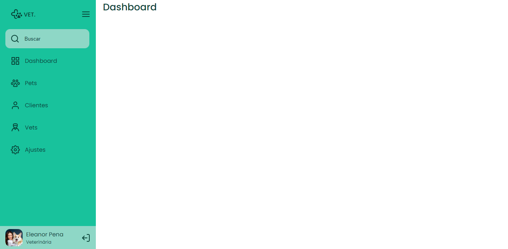
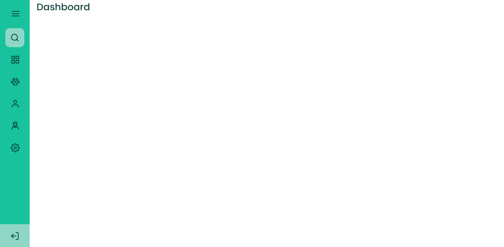

<h1 align="center"> Sidebar Responsiva  (Desafio Discover)</h1>

Layout uma Side Bar responsiva de um desafio do projeto Discover, promovido por <a href="https://rocketseat.com.br">RocketSeat</a>  

  <a href="#-tecnologias">Tecnologias</a>&nbsp;&nbsp;&nbsp;|&nbsp;&nbsp;&nbsp;
  <a href="#-projeto">Projeto</a>&nbsp;&nbsp;&nbsp;|&nbsp;&nbsp;&nbsp;
  <a href="#-layout">Layout</a>&nbsp;&nbsp;&nbsp;|&nbsp;&nbsp;&nbsp;

 

  
  

## 🚀 Tecnologias

Esse projeto foi desenvolvido com as seguintes tecnologias:

- HTML e CSS
- Javascrpt
- Git e Github
- Figma

## 💻 Projeto

Layout responsivo e animado de um Dashboard

- [Acesse o projeto finalizado, online clicando aqui](https://carlimaraujo.github.io/sidebar/)

## 🔖 Layout

Você pode visualizar o layout do projeto através [DESSE LINK](<https://www.figma.com/file/K2l3ZftDNFVR9aCKkwoCer/DD-%2F-Sidebar-Responsiva-(Copy)?node-id=0%3A1&t=AQ059esP2eW4cWFA-1>). É necessário ter conta no [Figma](https://figma.com) para acessá-lo.
